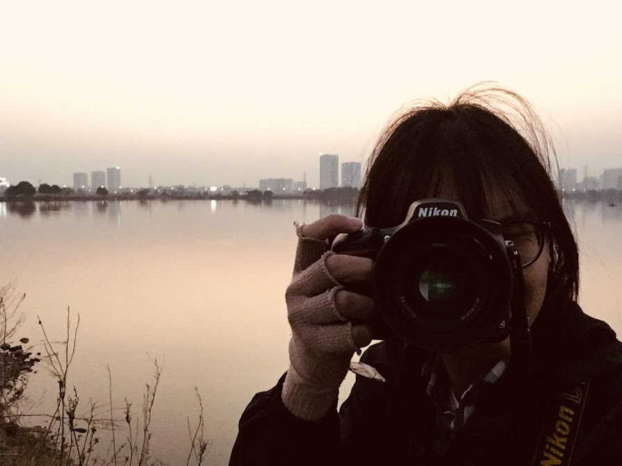

<!--<h1 align="center" style="font-weight:bold;text-decoration:none;">こんにちは、ボナちゃんです。初めまして。>o<"</h1>-->

<!--<h1 align="center" style="font-weight:bold;text-decoration:none;">これはボナちゃんのｷﾞﾄハブです。</h1>-->

<h1 align="center" style="font-weight:bold;text-decoration:none;">こんにちは、ボナちゃんです。初めまして。>o<"</h1>

<h1 align="center" style="font-weight:bold;text-decoration:none;">これはボナちゃんのｷﾞﾄハブです。</h1>

 

### About me
* Patriotic Otaku, Truely Nikonian.
* :boy: Đào Hiệp :japanese_ogre: Bonavadeur :smile_cat: ボナちゃん
* :school: Hanoi University of Science and Technology, Sep 2019 - May 2024
* :office: FPT Smart Cloud (FCI), Vietnam, May 2024 - Now
* :mailbox: daodaihiep22ussr@gmail.com
* :camera: :headphones: :tv: :book:

  

<!-- * :book: [Privé de Bonavadeur](https://prive.bonavadeur.pro) (
ボナちゃんのプヒベ) -->
<!-- MÒ TẬN VÀO ĐÂY ĐỌC THÌ CŨNG GHÊ ĐẤY, KIA LÀ BLOG CỦA WATASHI -->
<!--  -->
